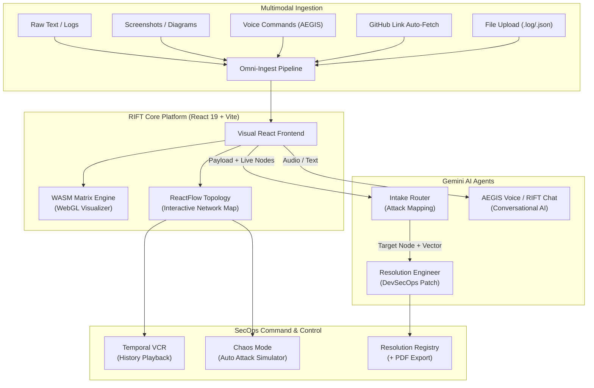

<div align="center">
  <h1>🌌 R I F T ▲</h1>
  <p><strong>Real-time Infrastructure Fault Topology</strong></p>
  <p><i>AI-Powered Network Observability & Autonomous Threat Remediation</i></p>
  <p><i>Powered by Google Gemini 2.5 Flash</i></p>
  <br/>
  <a href="https://rift-493520.uc.r.appspot.com"><strong>🔗 Live Demo →</strong></a>
</div>

<br/>

## 📖 Overview

RIFT is an AI-driven, real-time network observability command center that lets engineers visualize their entire cloud infrastructure as an interactive topology graph, feed it raw threat data — text, images, code, voice commands, or GitHub links — and watch an autonomous AI agent identify, attack-map, and self-remediate vulnerabilities directly on the graph.

Instead of drowning in logs and Slack alerts, RIFT provides a physical, interactive visualization of your network topology with AI-powered autonomous threat resolution.

---

## 🏗 System Architecture



---

## ✨ Features

### 1. Interactive Architecture Topology
Drag-and-drop 7 node types (API Gateway, Database, Cache, Kafka, S3, Worker, Frontend) onto an editable ReactFlow graph. Draw edges between nodes. The AI sees every node you add in real-time.

### 2. Multimodal AI Ingestion (5 Modalities)
Feed RIFT data through text, image screenshots, voice audio, file uploads, or GitHub links — all routed through the same Gemini-powered intake pipeline.

### 3. Autonomous Attack-Map & Self-Heal
The AI identifies the exact target node, turns it red on the graph, generates a DevSecOps remediation patch, applies it visually, and turns the node green — all autonomously within seconds.

### 4. AEGIS — Hands-Free Voice Conversation
A standalone voice AI assistant with Voice Activity Detection (VAD). Tap once to enter conversation mode — no buttons per turn. Speak naturally, AEGIS auto-detects silence, transmits, responds via TTS, and auto-resumes listening. Fully interruptible mid-sentence.

### 5. RIFT AI Assist — Text Chat Widget
A separate floating glassmorphic chat widget for text-based Q&A about your infrastructure, threats, and architecture.

### 6. Chaos Mode — Red Team Simulator
Auto-fires randomized attack payloads (DDoS, SQL Injection, OOM, JWT abuse) every 12 seconds through the full AI pipeline.

### 7. Temporal VCR — History Replay
Scrub backwards through every attack and resolution, replaying the exact graph state at any moment. Write-protected during playback.

### 8. Resolution Registry & PDF Export
Every AI-generated remediation is permanently logged. Export any patch as a formal "RIFT POST-MORTEM REPORT" PDF.

---

## 🛠 Tech Stack

| Layer | Technology |
|---|---|
| **Frontend** | React 19 + Vite 8 |
| **Graph Engine** | ReactFlow v11 |
| **AI** | Google Gemini 2.5 Flash (`@google/genai`) |
| **Voice Capture** | MediaRecorder API (audio/webm) |
| **Voice Detection** | Web Audio API (AudioContext + AnalyserNode) |
| **Text-to-Speech** | SpeechSynthesis API |
| **Visualization** | WebAssembly (AssemblyScript) + WebGL |
| **PDF Generation** | jsPDF |
| **Audio Feedback** | Web Audio API (OscillatorNode) |
| **Hosting** | Google Cloud App Engine |
| **Styling** | CSS3 with Glassmorphism, Light/Dark themes |

---

## 🚀 Quick Start

### Prerequisites
- **Node.js**: `v18+`
- **Google API Key**: From [Google AI Studio](https://aistudio.google.com)

### Setup

```bash
cd Rift
npm install
```

Configure your API key (or enter it in the browser UI):
```bash
echo "VITE_GEMINI_API_KEY=your_key_here" > .env
```

Build WASM and start:
```bash
npm run asbuild
npm run dev
```

Visit `http://localhost:5173`

---

## 🔒 Security

- **BYOK (Bring Your Own Key)** — API keys stored in `localStorage` only, never transmitted to any backend
- Keys are fully client-side — no server, no middleware, no credential exposure
- `.gcloudignore` ensures `.env` files never deploy to production
- HTTP 429 quota errors handled gracefully without modal loops

---

## 🌐 Deployment

Deployed on **Google Cloud App Engine**: [https://rift-493520.uc.r.appspot.com](https://rift-493520.uc.r.appspot.com)

```bash
npm run build
gcloud app deploy --quiet
```

---

<div align="center">
  <i>"Observe the threat. Neutralize the vector. Expand the architecture."</i>
</div>
