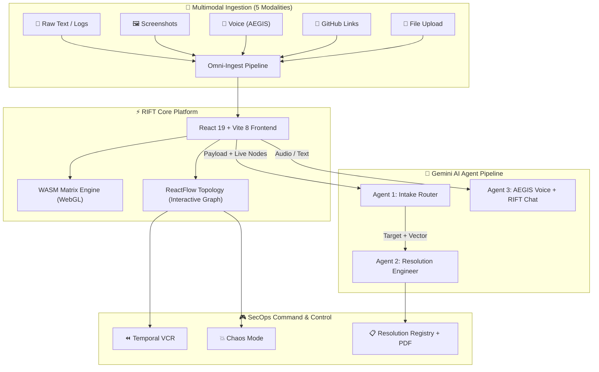

<div align="center">

# 🌌 R I F T ▲

### Real-time Infrastructure Fault Topology

**AI-Powered Network Observability & Autonomous Threat Remediation**

*Powered by Google Gemini 2.5 Flash Multimodal Intelligence*

<br/>

[](https://rift-493520.uc.r.appspot.com)

<br/>


</div>

<br/>

---

<br/>

## 💡 The Problem

Every enterprise runs hundreds of microservices. When something fails at 3 AM, engineers are drowning in logs, dashboards, and Slack alerts trying to find *which node is actually broken*.

Traditional observability gives you **walls of text**. RIFT gives you a **living, breathing architecture graph** where an AI can see your infrastructure the same way you do — and autonomously heal it.

<br/>

## 🧠 The Solution

> **What if an AI could look at your network graph, identify the exact node under attack, and generate a DevSecOps patch to fix it — all within seconds, with zero human intervention?**

RIFT is an **AI-powered command center** that:

1. 🔍 **Ingests** raw threat data through 5 modalities (text, image, voice, files, GitHub links)
2. 🎯 **Maps** each threat to the exact node on your live topology graph
3. 🔴 **Visualizes** the attack in real-time (node goes red, edges flash)
4. 🛠️ **Generates** a hyper-specific DevSecOps remediation patch via Gemini AI
5. 🟢 **Heals** the node autonomously (node goes green, patch logged)
6. 📄 **Audits** every resolution with exportable PDF post-mortem reports

The entire cycle completes in **under 10 seconds**, fully autonomously.

<br/>

---

<br/>

## 🏗️ Architecture



<br/>

---

<br/>

## ✨ Features

<br/>

### 🗺️ Interactive Architecture Topology

Build your infrastructure visually. Drag-and-drop **7 node types** onto an editable graph — API Gateways, Databases, Caches, Kafka Queues, S3 Buckets, Worker Instances, and Frontend UIs. Draw edges between them. Delete nodes. The AI sees every change in real-time.

<table>
<tr>
<td width="50%">

**Node Types**
- `API Gateway` — Ingress load balancers
- `Worker Instance` — Compute nodes
- `Database Storage` — SQL/NoSQL stores
- `S3 Bucket` — Object storage
- `Kafka Event Queue` — Message brokers
- `Redis Cache` — In-memory stores
- `Web Frontend UI` — Client-facing services

</td>
<td width="50%">

**Graph Capabilities**
- ✅ Drag-and-drop node creation
- ✅ Draw edges between any nodes
- ✅ Delete nodes with ✕ button
- ✅ Auto-fit viewport
- ✅ Real-time status indicators
- ✅ Visual attack/heal animations
- ✅ AI-aware (nodes auto-passed as context)

</td>
</tr>
</table>

<br/>

### 🔄 Multimodal AI Ingestion Engine

Feed RIFT data through **5 different input channels** — all routed through the same Gemini-powered intake pipeline:

| # | Modality | How It Works |
|---|---|---|
| 1 | **📝 Text** | Paste stack-traces, error messages, JSON logs, or plain English descriptions |
| 2 | **🖼️ Image** | Upload a screenshot of an error dialog, Grafana dashboard, or architecture diagram → Gemini Vision analyzes it |
| 3 | **🎤 Audio** | Speak via AEGIS → audio captured as `webm` → base64 → Gemini audio model |
| 4 | **📁 File** | Upload `.txt`, `.log`, `.json` files directly |
| 5 | **🔗 GitHub** | Paste any GitHub blob URL → RIFT auto-fetches raw file content and analyzes the code |

<br/>

### 🤖 Three Gemini AI Agents

| Agent | Role | Input | Output |
|---|---|---|---|
| **🔍 Intake Router** | Maps raw threat data to the exact node on your graph | Any payload + live node list | `{ target, type, chat_response }` |
| **🛠️ Resolution Engineer** | Generates hyper-specific DevSecOps remediation patches | Node name + attack vector | Technical remediation text |
| **💬 General Chat** | Powers both AEGIS voice and RIFT AI Assist text chat | User message + architecture context | Conversational response |

<br/>

### 🔵 AEGIS — Hands-Free Voice AI

AEGIS is a standalone voice conversation system — like talking to another human. No buttons per turn. No clicking. **Just talk.**

<table>
<tr>
<td width="55%">

**How It Works**
1. **Tap the orb once** → enters conversation mode
2. **Voice Activity Detection** monitors your mic at 100ms intervals via Web Audio API
3. **When you speak** → AEGIS detects audio above threshold
4. **When you stop** → 1.5s of silence → auto-transmits to Gemini
5. **AEGIS responds** via Text-to-Speech (British English voice)
6. **Auto-resumes listening** after speaking — no clicks needed
7. **Interrupt anytime** — speak while AEGIS talks and it cancels instantly
8. **Tap again** → ends conversation

</td>
<td width="45%">

**Dynamic Visual States**

| State | Orb | Label |
|---|---|---|
| Idle | 🔵 Blue gradient | `AEGIS` |
| Listening | 🔴 Red pulsing rings | `LISTENING...` |
| Processing | 🟡 Amber spinning ring | `THINKING...` |
| Speaking | 🟢 Green breathing glow | `SPEAKING...` |
| Active | 🟣 Indigo glow | `TAP TO END` |

</td>
</tr>
</table>

<br/>

### 💬 RIFT AI Assist — Text Chat

A separate floating glassmorphic chat widget (bottom-right corner) for silent, text-based Q&A about your platform, architecture, and threats. Completely independent from AEGIS — **two AI surfaces, two different interaction paradigms**.

<br/>

### 💥 Chaos Mode — Red Team Simulator

One-click autonomous attack simulator. Auto-fires randomized threat payloads every 12 seconds:

| Attack | Vector |
|---|---|
| `DETECTED DDOS ON MAIN INGRESS` | Volumetric flood |
| `SQL INJECTION ATTEMPT '; DROP TABLE` | Database exploitation |
| `OOM ERROR MEMORY LEAK REPORTED` | Resource exhaustion |
| `UNAUTHORIZED JWT TOKEN USAGE` | Auth bypass |
| `FAILED CONNECTION TIMEOUT 504` | Service degradation |

Each auto-attack runs through the **full AI pipeline** — intake → attack → resolution → heal — completely autonomously.

<br/>

### ⏪ Temporal VCR — History Replay

Every state change is captured as a snapshot. Drag the timeline scrubber to replay any moment in your infrastructure's history — see the exact graph state before, during, and after any attack. Write-protected during playback.

<br/>

### 📋 Resolution Registry & PDF Export

Every AI-generated remediation is permanently logged with timestamp, target node, attack vector, and full patch text. Export any resolution as a formal **"RIFT POST-MORTEM REPORT"** PDF in monospace courier format.

<br/>

### 🔊 Audio Feedback System

Synthesized audio cues using Web Audio API oscillators:

| Sound | Trigger | Waveform |
|---|---|---|
| ⚠️ Alert Beep | Node goes critical | Two-tone square wave (600Hz → 450Hz) |
| ✅ Success Chirp | Node heals | Ascending sine triad (600Hz → 900Hz → 1200Hz) |

<br/>

### 🌗 Theme System

| Mode | Description |
|---|---|
| ☀️ **Daylight** | Clean white background, subtle radial gradients |
| 🌙 **Cyber-Nights** | Deep `#0A0A0A` dark mode, glassmorphic panels, `backdrop-filter: blur(24px)` |

<br/>

---

<br/>

## 🛠️ Tech Stack

<table>
<tr>
<td align="center" width="100"><br/><br/><sub><b>React 19</b></sub><br/></td>
<td align="center" width="100"><br/><br/><sub><b>Vite 8</b></sub><br/></td>
<td align="center" width="100"><br/><br/><sub><b>JavaScript</b></sub><br/></td>
<td align="center" width="100"><br/><br/><sub><b>CSS3</b></sub><br/></td>
<td align="center" width="100"><br/><br/><sub><b>Gemini AI</b></sub><br/></td>
<td align="center" width="100"><br/><br/><sub><b>App Engine</b></sub><br/></td>
</tr>
<tr>
<td align="center" width="100"><br/><br/><sub><b>WASM</b></sub><br/></td>
<td align="center" width="100"><br/><br/><sub><b>AssemblyScript</b></sub><br/></td>
<td align="center" width="100"><br/><br/><sub><b>Node.js</b></sub><br/></td>
<td align="center" width="100"><br/><br/><sub><b>HTML5</b></sub><br/></td>
<td align="center" width="100"><br/>🎙️<br/><sub><b>Web Audio API</b></sub><br/></td>
<td align="center" width="100"><br/>📄<br/><sub><b>jsPDF</b></sub><br/></td>
</tr>
</table>

<br/>

| Layer | Technology | Purpose |
|---|---|---|
| **Frontend** | React 19 + Vite 8 | UI framework & build system |
| **Graph Engine** | ReactFlow v11 | Interactive network topology |
| **AI Backend** | Gemini 2.5 Flash (`@google/genai`) | 3 autonomous AI agents |
| **Voice Capture** | MediaRecorder API | Audio recording (webm) |
| **Voice Detection** | Web Audio API (`AnalyserNode`) | Real-time VAD at 100ms |
| **Text-to-Speech** | SpeechSynthesis API | AEGIS voice output |
| **Visualization** | AssemblyScript → WASM + WebGL | Matrix threat renderer |
| **Audio** | Web Audio API (`OscillatorNode`) | Alert beeps, success chirps |
| **PDF** | jsPDF v4 | Post-mortem report export |
| **Styling** | CSS3 + Google Fonts | Glassmorphism, dual themes |
| **Hosting** | Google Cloud App Engine | Production deployment |

<br/>

---

<br/>

## 🚀 Getting Started

### Prerequisites

| Requirement | Note |
|---|---|
| **Node.js** `v18+` | Required |
| **Google API Key** | *Optional* — You can enter it directly in the browser UI. Only needed in `.env` for development convenience. |

### Installation

```bash
# Clone the repository
git clone https://github.com/omshukla24/Rift.git
cd Rift/Rift

# Install dependencies
npm install

# (Optional) Set API key for development
echo "VITE_GEMINI_API_KEY=your_key_here" > .env

# Build the WASM matrix engine
npm run asbuild

# Start development server
npm run dev
```

Visit **`http://localhost:5173`** — the dashboard will load with a live topology graph.

> 💡 **No API key in `.env`?** No problem — RIFT will prompt you to enter one directly in the browser. Your key is stored in `localStorage` and never leaves your machine.

<br/>

---

<br/>

## 🔒 Security

<table>
<tr>
<td>🔑</td>
<td><strong>BYOK (Bring Your Own Key)</strong> — API keys stored in <code>localStorage</code> only. Never transmitted to any backend server.</td>
</tr>
<tr>
<td>🚫</td>
<td><strong>No Backend</strong> — All AI calls go directly from your browser to Google's Gemini API. Zero middleware. Zero credential exposure.</td>
</tr>
<tr>
<td>🔐</td>
<td><strong>Build Obfuscation</strong> — Keys in <code>.env</code> are compiled into minified chunks during <code>vite build</code>, never stored as plaintext.</td>
</tr>
<tr>
<td>📦</td>
<td><strong>Deploy Guard</strong> — <code>.gcloudignore</code> ensures <code>.env</code> files never reach production. <code>.gitignore</code> prevents git tracking.</td>
</tr>
<tr>
<td>⚡</td>
<td><strong>Quota Handling</strong> — HTTP 429 errors caught gracefully and displayed as inline messages, not blocking modals.</td>
</tr>
</table>

<br/>

---

<br/>

## 🌐 Deployment

Deployed on **Google Cloud App Engine**:

```bash
npm run build
gcloud app deploy --quiet
```

| Detail | Value |
|---|---|
| **Platform** | Google Cloud App Engine (Standard) |
| **Runtime** | Node.js 20 |
| **URL** | [rift-493520.uc.r.appspot.com](https://rift-493520.uc.r.appspot.com) |

<br/>

---

<br/>

## 📂 Project Structure

```
Rift/
├── src/
│   ├── App.jsx              # Main dashboard — state, logic, UI (900+ lines)
│   ├── RiftMap.jsx           # ReactFlow wrapper + custom node component
│   ├── MatrixRenderer.jsx    # WebGL/WASM cellular automaton visualizer
│   ├── index.css             # Design system — themes, animations (850+ lines)
│   ├── App.css               # Component styles
│   ├── main.jsx              # React DOM entry point
│   └── lib/
│       ├── gemini.js          # 3 Gemini AI agent functions + key management
│       └── audio.js           # Synthesized alert/success audio
├── assembly/
│   └── index.ts              # AssemblyScript WASM source
├── public/
│   └── release.wasm          # Compiled WASM binary
├── app.yaml                  # App Engine deployment config
├── package.json              # Dependencies & scripts
└── vite.config.js            # Build configuration
```

<br/>

---

<br/>

<div align="center">

### 🌌

*"Observe the threat. Neutralize the vector. Expand the architecture."*

<br/>

**Built for the Google Tech Builders Program**

<br/>

[](https://rift-493520.uc.r.appspot.com)
[](https://ai.google.dev)

</div>
