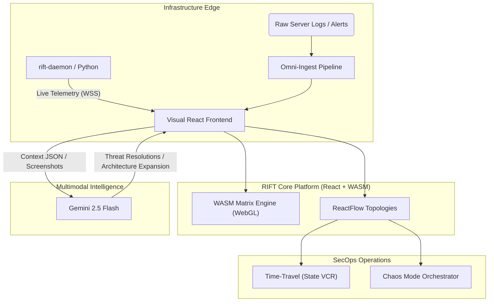

# RIFT
## Autonomous Cybersecurity Observability & Response Platform

RIFT is an enterprise-grade platform designed to visually orchestrate and neutralize cyber threats using the Gemini 2.5 Flash native Multimodal Intelligence ecosystem. 

By replacing thousands of lines of generic log-text with a dynamic, physical, 2D layout of your network, RIFT allows security engineering teams to observe active DDoS attacks, SQL Injections, and anomalous payloads, instantly applying DevSecOps resolutions.

---

### 🏗 System Architecture

### Platform Capability Matrix
- **Omni-Ingest Pipeline**: Native engine capable of parsing raw text logs, error screenshots, JSON payloads, and unstructured alerts into structured architectural targets using Gemini Multimodal vision execution.
- **Dynamic ReactFlow Topologies**: Natively hook, assemble, and expand complex cloud architectures (Gateways, S3 Buckets, Cache nodes) by physically dragging elements. The Gemini Agent automatically strings visual architecture into Context JSON, allowing zero-config dynamic scaling.
- **Chaos Mode Simulator**: An autonomous Red-Team orchestrator built in. Once executed, it simulates high-stress volumetric payloads organically across your deployed infrastructure allowing engineers to observe and tune the AI response logic.
- **Time-Travel Operations (VCR)**: Captures immutable array states natively, granting DevOps teams the capability to drag an operational scrubber back through time to freeze the physical network configuration directly before, during, or after a compromise.

### Tech Stack
- **Frontend**: `React 19` + `Vite` + `ReactFlow`
- **Intelligent Routing Framework**: `@google/genai` (Native Gemini 2.5 Flash SDK)
- **Visuals / Compute**: Custom WebAssembly (WASM) Matrix Renderer + WebGL
- **Host Daemon**: `Python 3` + `websockets` + `psutil`
- **Structural UI**: Custom CSS Light Glassmorphism Architecture (Vercel-Inspired)

### Secure By Design
Deployed securely to Google Cloud App Engine (`app.yaml`). API Keys are securely obfuscated into minified binary chunks during initial `npm build` deployment, restricting raw `.env` payload transmission via strict `.gcloudignore` protocols.

Built for the LAPLACE / Tech Builders deployment footprint.
