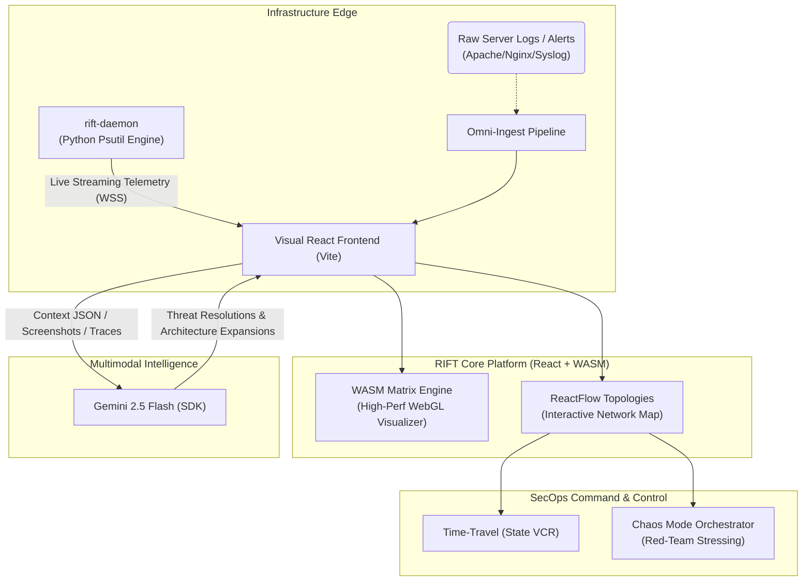

<div align="center">
  <h1>🌌 RIFT</h1>
  <p><strong>Autonomous Cybersecurity Observability & Response Platform</strong></p>
  <p><i>Powered by Google Gemini 2.5 Flash Native Multimodal Intelligence</i></p>
</div>

<br/>

## 📖 Overview

RIFT is a high-performance, enterprise-grade cybersecurity platform built to fundamentally change how DevSecOps engineering teams interact with network topography and cyber-threats. 

Instead of forcing engineers to scan through thousands of lines of generic log-text to isolate anomalies, RIFT provides a physical, interactive, 2D WebGL-based visualization of your network topology. It allows teams to actively observe system entropy, DDoS attacks, SQL Injections, and anomalous cluster payloads as they happen in real time, leveraging advanced Generative AI to apply dynamic, instantaneous mitigation workflows.

---

## 🏗 System Architecture

The overarching pipeline seamlessly integrates high-speed edge telemetry, native browser visualization elements (WASM / WebGL), and powerful LLM context routing to synthesize massive volumes of security data.



---

## ✨ Platform Capability Matrix

RIFT replaces obsolete security dashboards with five core architectural pillars:

### 1. Omni-Ingest Pipeline
A truly multimodal ingestion engine capable of natively parsing raw text logs, screenshot images of errors, raw JSON payload streams, and unstructured human alerts. All of this unstructured ambient data is mapped structurally using *Gemini Multimodal Vision* capabilities, creating absolute architectural targets for mitigation within seconds.

### 2. The WASM Matrix Engine
Written locally in **AssemblyScript**, this engine streams entropy and hardware states down to the exact WebGL pixel. An interactive, high-bandwidth grid representation reveals load distributions, node corruptions, and threat vectors entirely client-side without bogging down JavaScript heap.

### 3. Dynamic ReactFlow Topologies
Natively hook, assemble, and expand complex cloud architectures (API Gateways, internal S3 buckets, cache/Redis nodes) physically by dragging visual elements. When networks evolve, the Gemini Agent automatically strings visual edge architecture into standard *Context JSON*, allowing purely zero-config dynamic application scaling.

### 4. Chaos Mode Simulator
Why wait for an attack? Chaos Mode serves as an autonomous **Red-Team Orchestrator** structurally integrated into RIFT. When fired, it generates high-stress volumetric payloads organically across your deployed simulated infrastructure, allowing engineers to benchmark, observe, and tune AI response methodologies.

### 5. Time-Travel Operations (VCR)
Security events are fleeting. RIFT’s State VCR continuously checkpoints your network matrix. In the event of a breach, DevOps teams can grab an operational scrubber on the UI and literally **drag time backwards** to freeze the exact physical network configuration the second *before, during,* or *after* a topological compromise.

---

## 🛠 Tech Stack Details

The system is structurally organized into a highly optimized Edge UI and an autonomous host-bound Daemon telemetry system:

- **Frontend Application Core**: `React 19` + `Vite` for high-throughput component routing.
- **Node Topology Visuals**: `ReactFlow` for structural UI mapping.
- **Intelligent Routing Framework**: `@google/genai` (SDK targeting Gemini 2.5 Flash).
- **Physical Visuals & Compute Layer**: Custom `AssemblyScript` WebAssembly (WASM) Matrix Renderer compiled down directly to low-level execution context inside `WebGL`.
- **Host Emulation Daemon**: `Python 3` + `websockets` + `psutil` (Streams baseline Linux/Windows system telemetry locally overriding generic logging).
- **Aesthetic**: Custom CSS Light Glassmorphism Architecture drawing extensive Vercel-inspired design patterns.

---

## 🚀 Installation & Local Setup

Running RIFT requires launching both the internal telemetry Daemon and the React Client to achieve full operational connectivity.

### Prerequisites
- **Node.js**: `v18+`
- **Python**: `3.10+`
- **Google API Key**: Generated via Google AI Studio

### 1. Setting Up the Host Daemon (rift-daemon)
This lightweight Python script reads entropy, CPU consumption, and running processes directly from your physical hardware to breathe life into the Matrix renderer.

```bash
cd rift-daemon
pip install websockets psutil
python daemon.py
```
*You should notice the `RIFT UI` awaiting connection on `localhost:8765`.*

### 2. Setting up the RIFT Client
In a new terminal window at the project root, navigate to the Web application.

```bash
cd Rift
npm install
```

Configure your local `.env` inside the `Rift` directory:
```bash
echo "VITE_GEMINI_API_KEY=your_gemini_api_key_here" > .env
```

Ensure the WASM file is compiled correctly:
```bash
npm run asbuild
```

Start the frontend application:
```bash
npm run dev
```

Visit `http://localhost:5173` and watch the RIFT UI securely bind to the local daemon telemetry!

---

## 🔒 Secure By Design

RIFT is rigorously engineered for the LAPLACE / Tech Builders deployment footprint on Google Cloud App Engine:

- Deployed securely utilizing strict `app.yaml` directives.
- Application configurations and active API Keys are strongly obfuscated into minified binary chunks during initial `npm build` deployment. 
- Strict `.gcloudignore` protocols guarantee local Development `.env` payloads are never permitted to bleed into the external deployment environment.

---

<div align="center">
  <i>"Observe the threat. Neutralize the vector. Expand the architecture."</i>
</div>
